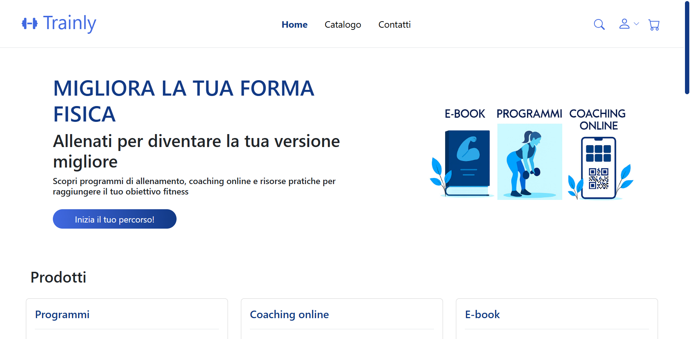
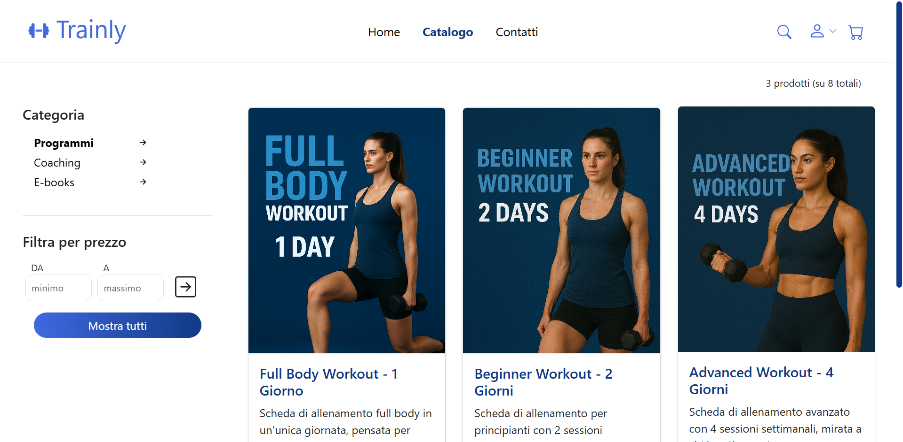
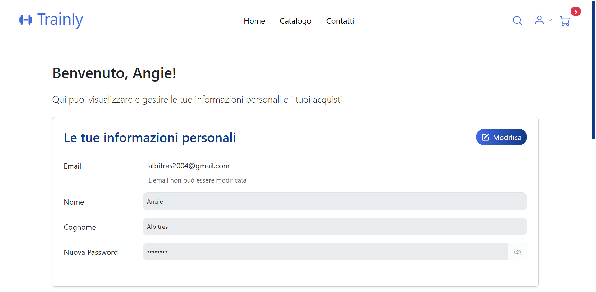

<div align="center">
  <h1>🏋️ Trainly</h1>
  <p>
    Una piattaforma E-commerce web completa per il fitness, dedicata alla vendita di prodotti e servizi digitali.
    <br />
    Visita il sito: https://trainly.onrender.com
    <br />
    <br />
    
    
    
  </p>
</div>

---

## 🧐 Di cosa si tratta?

Questo progetto implementa una **Web App E-commerce** dinamica e responsive. È progettata per gestire l'intero ciclo di vita di un acquisto online, dalla navigazione del catalogo fino alla gestione degli ordini, con aree riservate per utenti e amministratori.

Le funzionalità principali includono:
* **Catalogo Dinamico:** Esplorazione e ricerca prodotti gestita tramite template engine EJS.
* **Gestione Carrello:** Aggiunta e rimozione prodotti con calcolo automatico dei totali.
* **Area Amministrativa:** Pannello di controllo per gestire prodotti (CRUD completo) e visualizzare gli ordini degli utenti.

---

## 🛠️ Funzionalità del Codice

Il core del progetto è basato su **Express.js** e organizzato secondo il pattern MVC. Ecco i moduli principali disponibili:

- `Autenticazione`: Gestione sicura di login e registrazione tramite **Passport.js** e hashing delle password con **Bcrypt**.
- `Gestione Prodotti`: API per creare, modificare ed eliminare articoli dal database SQLite (`products` table).
- `Sistema Ordini`: Logica per convertire il contenuto del carrello (`cart_items`) in un ordine confermato (`orders`).
- `Middleware`: Controllo degli accessi per proteggere le route sensibili (es. solo Admin).
- `Database`: Utilizzo di **SQLite** per un'archiviazione dati leggera e portabile senza configurazioni complesse.

---

## 🚀 Esempio di Utilizzo (Account Test)

Per utilizzare l'applicazione e testare i diversi ruoli, utilizza le seguenti credenziali pre-configurate:

| Ruolo | Email | Password |
| :--- | :--- | :--- |
| 👑 **Admin** | `admin@trainly.com` | `Admin123!` |
| 🧑 **User** | `albitres2004@gmail.com` | `Test123!` |
| 🧑 **User** | `lucia.bianchi@gmail.com` | `Test123!` |

---

## 📸 Screenshot dell'Applicazione





---

## 📂 Struttura del Progetto

Ecco come è organizzato il codice sorgente:

```text
trainly/
├── 📁 bin/
│   └── 📄 www                 # Script di avvio del server
├── 📁 middleware/
│   ├── 📄 autorizzazioni.js   # Gestione permessi (isAuthenticated, isAdmin)
│   └── 📄 passport.js         # Strategia di autenticazione locale
├── 📁 models/
│   └── 📁 dao/                # Data Access Objects (Query SQL dirette)
│       ├── 📄 prodotti-dao.js
│       ├── 📄 ordini-dao.js
│       └── ... (altri DAO per carrello, utenti, ecc.)
├── 📁 public/
│   ├── 📁 img/                # Immagini prodotti e layout
│   ├── 📁 js/                 # Script Frontend (Logica carrello, Fetch API)
│   └── 📁 stylesheets/        # Stili CSS personalizzati
├── 📁 routes/
│   ├── 📄 api.js              # Endpoint API (JSON) per il frontend
│   └── 📄 auth.js             # Route per navigazione pagine e login
├── 📁 views/                  # Template Engine (EJS)
│   ├── 📁 partials/           # Componenti riutilizzabili (Navbar, Footer)
│   ├── 📄 index.ejs           # Homepage
│   ├── 📄 catalogo.ejs        # Pagina prodotti
│   └── ... (altre viste)
├── 📄 .env                    # Variabili d'ambiente (Porta, Secret)
├── 📄 app.js                  # Configurazione principale Express
├── 📄 db.js                   # Connessione e inizializzazione SQLite
├── 📄 schema.sql              # Schema DDL del database
└── 📄 package.json            # Dipendenze del progetto
```
---

## 🗄️ Struttura Dati

Il progetto include uno schema database relazionale (**SQLite**) già strutturato per garantire l'integrità delle informazioni.
Il file `schema.sql` definisce le seguenti entità:

* ✅ **Users**: Memorizzazione sicura degli utenti e dei ruoli (Admin/User).
* ✅ **Products**: Catalogo articoli con dettagli, prezzi e immagini.
* ✅ **Orders & Items**: Tracciamento storico degli acquisti effettuati.
* ✅ **Cart**: Persistenza del carrello utente tra le sessioni.
* ✅ **Newsletter**: Raccolta contatti per marketing (opzionale).

Il database viene inizializzato automaticamente al primo avvio tramite `db.js`.

---
## ⚙️ Installazione e Setup

Poiché il progetto è configurato come applicazione **Node.js**, segui questi passaggi per avviarlo correttamente in locale:

1.  **Clona la repository:**
    ```bash
    git clone https://github.com/angie-albi/trainly.git
    ```
2.  **Entra nella cartella del progetto:**
    ```bash
    cd trainly
    ```
3.  **Installa le dipendenze necessarie:**
    ```bash
    npm install
    ```
4.  **Configura le Variabili d'Ambiente (Importante 🚨):**
    Per questioni di sicurezza, le credenziali e le chiavi segrete non sono incluse nella repository. 
    * Troverai un file chiamato `.env.example`.
    * Creane una copia nella stessa cartella e rinominala in `.env` (su terminale puoi fare: `cp .env.example .env`).
    * Compila il file `.env` inserendo una stringa a tua scelta per `SESSION_SECRET`.
5.  **Avvia l'applicazione** (il database SQLite verrà creato e inizializzato in automatico):
    ```bash
    npm start
    ```
6.  **Visita il sito:** Apri il tuo browser all'indirizzo `http://localhost:3000`
---

### 👤 Autore

Sviluppato da **Angie Albitres**